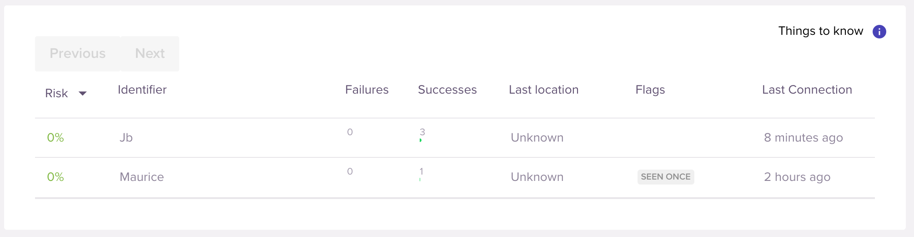

# Sqreen user monitoring for Wordpress

Automatically monitor Wordpress with [Sqreen PHP
agent](https://docs.sqreen.com/php/introduction/).

These following events are automatically tracked:

- Login success
- Login failure
- Signup

## Getting started

### Install and configure Sqreen for PHP

[Sqreen for PHP](https://docs.sqreen.com/php/introduction/)

### Install the plugin

Login to your Wordpress instance. Go to:
Plugins > Add new > Upload plugin

Download the plugin Zip archive from the [GitHub releases
page](https://github.com/sqreen/sqreen-monitoring-wordpress/releases),
and upload it
Click "Install now", then "Activate Plugin".

You are all set: Wordpress should now report events to Sqreen automatically.
Check it [in the Sqreen dashboard](https://my.sqreen.com).

### Test the plugin

Log out from Wordpress and login again. After a few seconds, you should see
users appearing in your Sqreen dashboard.

### Ensure your users are protected

Sqreen can protect your users against [Account Take
Over](https://docs.sqreen.com/protection/introduction/#account-takeover-ato).

For example, see how we are using Sqreen to protect ourselves and [block
account take over attacks against
ourselves](https://blog.sqreen.com/blocked-major-ato-attack-sqreen-deployment/).

## Development: Packaging the plugin

- Run `build.sh`
- Plugin archive is generated in `dist/`
